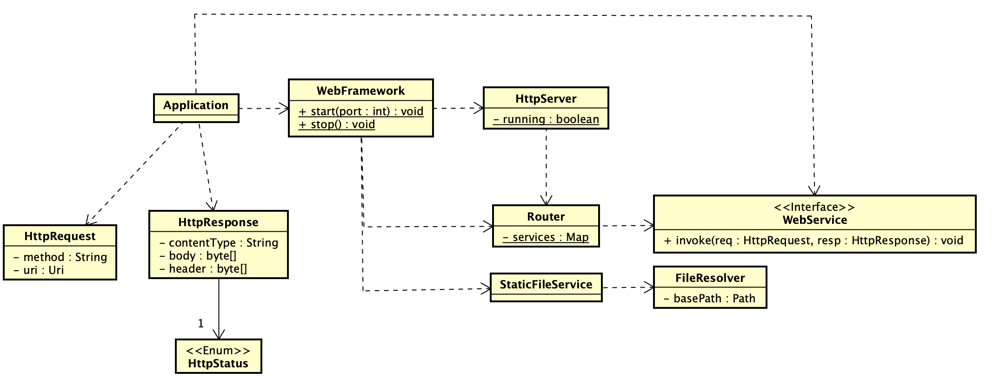
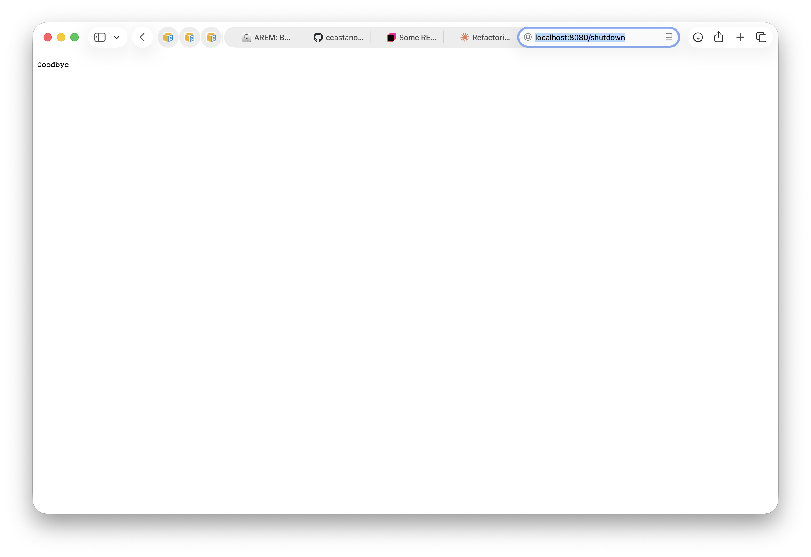
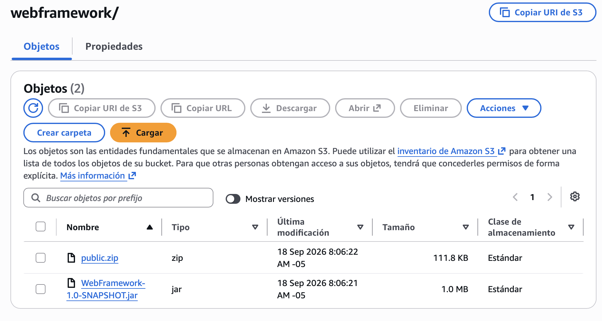
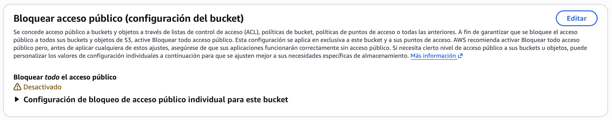
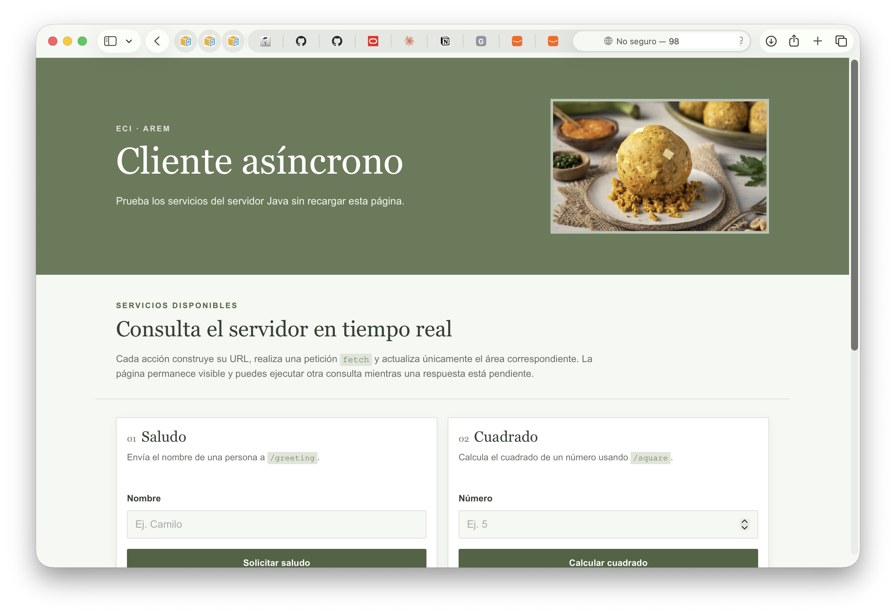
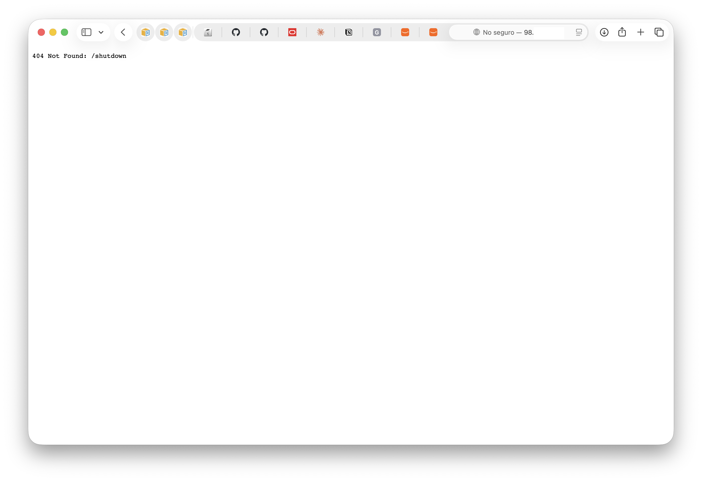

# WebFramework

## Project title and description

**WebFramework** is a project for the **Enterprise Architectures** course at **Escuela Colombiana de Ingeniería Julio Garavito**. The project seeks to continue with [HttpServers project](https://github.com/ccastano46/HttpServers.git), refactoring it into a lightweight web framework inspired by Spark Java, where routes are registered as lambda expressions through a simple API. The project handles request parsing, response building, static file serving, and error responses internally, letting the developer define application behavior in `eci.arem.app.Application` class.

As in the last project, the application includes a browser client for the services `/greeting`, `/square`, `/server-time`, and `/health`. The browser client sends asynchronous `GET` requests and updates the page without performing a full reload. The same server can also deliver static resources, such as HTML, CSS files, JavaScript files, and PNG images, through the static-file route.

The application is deployed to an **Amazon EC2 instance** running Amazon Linux 2023. The instance uses a **User Data** startup script that automatically provisions the environment on first boot: it installs the required Java runtime, downloads the packaged application artifact and static resources from an S3 bucket, and starts the server using `java -jar`. The entry point is `eci.arem.app.Application`

The application reads the following environment variables at startup. If a variable is not defined, the corresponding default value is used:

| Variable      | Purpose                                              | Default Value               |
|---------------|------------------------------------------------------|-----------------------------|
| `PORT`        | TCP port the HTTP server listens on                  | `8080`                      |
| `STATIC_PATH` | Root directory where static resources are located    | `src/main/resources/public` |
| `APP_ENV`     | Execution environment | `development`               |

> When `APP_ENV` is set to `production`, the `/shutdown` endpoint is disabled to prevent remote termination of the server.

## System metaphor and architecture

### Architecture Metaphor

The framework can be understood as a **single-entrance office building**. A visitor (the browser) walks up to the front door and hands over a request. The building operates with one receptionist, so visitors are attended one at a time, if two arrive simultaneously, the second waits in the lobby until the first is fully served.

| Building metaphor              | Framework component                                                                                                                                                                                                                                                                                                                                                                                                                    |
|--------------------------------|----------------------------------------------------------------------------------------------------------------------------------------------------------------------------------------------------------------------------------------------------------------------------------------------------------------------------------------------------------------------------------------------------------------------------------------|
| **Building entrance**          | `HttpServer`: the front door that accepts one visitor at a time through a `ServerSocket`. It reads who they are and what they need (`parse`), then passes them to the lobby directory.                                                                                                                                                                                                                                                 |
| **Lobby directory**            | `Router`: the board in the lobby that lists which offices are available. It checks the visitor's request against the registered offices (`Map<String, WebService>`). If the office exists, the visitor is escorted there. If not, it checks the document archive. If nothing matches, the visitor receives a "not found" notice. If the visitor entered through the wrong door (wrong HTTP method), they are turned away at the lobby. |
| **Individual offices**         | Lambda handlers registered via `get("/path", (req, resp) -> {...})`: each office handles a specific service. The `/hello` office writes greetings, the `/square` office computes numbers, the `/time` office reads the building clock. Each office fills out a response form (`HttpResponse`) and hands it back through the lobby.                                                                                                     |
| **Document archive**           | `StaticFileService` and `FileResolver`: when no office handles the request, the directory sends the visitor to the archive room, which stores HTML, CSS, JavaScript, and images. The archivist locates the file, stamps it with its type, and delivers it directly — no office visit required.                                                                                                                                         |
| **The visitor's form**         | `HttpRequest`: the form each visitor fills out at the entrance, their name (method), where they want to go (path), and any special notes (query parameters). This form is passed unchanged to whoever serves them.                                                                                                                                                                                                                     |
| **The response envelope**      | `HttpResponse`: every answer, whether from an office or the archive, is placed in the same kind of envelope. It carries the content (body), a label (content type), and a status stamp (status code). The header is printed on the envelope just before it is handed back to the visitor.                                                                                                                                              |
| **The building directory sign** | `WebFramework`: the public-facing sign outside that advertises the building's services. The building manager (`Application.java`) reads this sign to know what can be configured: `get()` to open a new office, `staticfiles()` to stock the archive, `start()` to open the building, and `stop()` to close it.                                                                                                                        |
| **Building regulations**       | Environment variables (`PORT`, `STATIC_PATH`, `APP_ENV`): external rules that govern how the building operates. Changing the port is like changing the building's street address. Setting `APP_ENV=production` locks the emergency exit. The `/shutdown` door is disabled, and only the building administrator can close the building from outside.                                                                                    |
| **Closing procedure**          | Graceful shutdown: when the `/shutdown` office is visited (only in development), the receptionist finishes serving the current visitor, delivers the full response, closes the connection, and only then locks the front door (`running = false`). No visitor is left mid-conversation.                                                                                                                                                |

### Architecture diagram

The following UML diagram represents the main classes and relationships in the framework architecture.


## Component responsibilities

| Component | Responsibility                                                                                                                                                                                                                                                                                                                                       | Current implementation |
|---|------------------------------------------------------------------------------------------------------------------------------------------------------------------------------------------------------------------------------------------------------------------------------------------------------------------------------------------------------|---|
| Browser client | Presents the laboratory interface, validates basic input, builds service URLs, sends asynchronous requests, displays loading states, and separates successful results from errors.                                                                                                                                                                   | `src/main/resources/public/async-client.html`, `scripts/async-client.js`, and `styles/async-client.css` |
| `Application` | Acts as the composition root: reads environment variables (`PORT`, `STATIC_PATH`, `APP_ENV`), registers all lambda-based routes via `WebFramework.get()`, conditionally enables `/shutdown` in development mode, and starts the server.                                                                                                              | `eci.arem.app.Application` |
| `WebFramework` | Exposes `get()`, `staticFiles()`, `start()`, and `stop()`. Delegates route registration to `Router`, static file configuration to `StaticFileService`, and server lifecycle to `HttpServer`. Contains no logic of its own.                                                                                                                           | `eci.arem.webframework.WebFramework` |
| `HttpServer` | Opens the listening socket on the configured port, accepts one client connection at a time within a sequential `while` loop, parses the raw request line, delegates routing to `Router`, writes the response, and closes the connection. Isolates each connection with `try-with-resources` to prevent a single failure from terminating the server. | `eci.arem.server.HttpServer` |
| `Router` | Owns the route registry (`Map<String, WebService>`), evaluates each incoming request against registered routes, and delegates to the matching lambda handler. If no route matches, falls back to `StaticFileService`. Handles error responses for bad methods, bad requests, not-found resources, and internal errors.                               | `eci.arem.server.Router` |
| `WebService` | Functional interface that defines the contract for lambda handlers: `void invoke(HttpRequest request, HttpResponse response)`. Each registered route is an implementation of this interface.                                                                                                                                                         | `eci.arem.server.WebService` |
| `HttpRequest` | Represents a parsed HTTP request. Holds the method, path, and query string extracted from the request line. Provides `getValue(key)` to retrieve and URL-decode individual query parameters.                                                                                                                                                         | `eci.arem.http.HttpRequest` |
| `HttpResponse` | Represents an HTTP response. Carries the status code, content type, and body as `byte[]`. Builds the raw HTTP header (`status line + Content-Type + Content-Length`) on demand via `getHeader()`. Defaults to `200 OK` and `text/plain`.                                                                                                             | `eci.arem.http.HttpResponse` |
| `HttpStatus` | Enum of standard HTTP status codes (`OK`, `BAD_REQUEST`, `NOT_FOUND`, `INTERNAL_SERVER_ERROR`, etc.) with numeric code and description. Used by `HttpResponse` to build the status line.                                                                                                                                                             | `eci.arem.http.HttpStatus` |
| `StaticFileService` | Serves static resources when no dynamic route matches. Reads file bytes through `FileResolver`, determines the content type, and maps `/` to the default page. Delegates the base path configuration from `WebFramework.staticFiles()`.                                                                                                              | `eci.arem.service.StaticFileService` |
| `FileResolver` | Resolves a requested path against the configured base directory, rejects paths that escape it (path traversal protection), reads the file bytes from disk, and determines the MIME type based on file extension.                                                                                                                                     | `eci.arem.service.FileResolver` |
| Public resources | Static files served by the Java server: HTML pages, stylesheets, JavaScript modules, and images that compose the browser-side interface.                                                                                                                                                                                                             | `src/main/resources/public/` |

### Supported request surface

The server exposes a deliberately limited request surface. The route definitions are represented below with general parameter placeholders.

| Method | URL                                                     |
|---|---------------------------------------------------------|
| `GET` | `/`                                                     |
| `GET` | `/hello?name=[name]`                                    |
| `GET` | `/square?value=[number]`                                |
| `GET` | `/time`                                                 |
| `GET` | `/health`                                               |
| `GET` | `/shutdown`                                             |
| `GET` | `/index.html` and other supported static-resource paths |

A missing required `name` or `value` parameter returns `400 Bad Request`. A non-`GET` method returns `400 Bad Request`. A requested static file that does not exist returns `404 Not Found`. An unrecognized service URL reaches the fallback bad-request route and returns `404 Not Found`..

## Prerequisites
- **Java 25** (JDK) to compile and run the server.
- **Maven 3.6+** to compile and package the project.
- **Postman or other service** to test the server.
- **A browser** to test the client.

## How to run the project locally
Clone [HttpServers repository](https://github.com/ccastano46/HttpServers.git)

```bash
git clone https://github.com/ccastano46/WebFramework.git
```
Build the executable JAR with Maven:

```bash
mvn clean package
```

Copy the `public/` directory to the `target/` directory:
```bash
cp -r src/main/resources/public target/
```
Run the server, remember that because the basePath is `public` you have to be inside the `target/` directory.
```bash
STATIC_PATH=target/public java -jar target/WebFramework-1.0-SNAPSHOT.jar
```
The default local address is:

```text
http://localhost:8080/
```

To use another port, set `PORT` before starting the server:

```bash
PORT=35000 STATIC_PATH=target/public java -jar target/WebFramework-1.0-SNAPSHOT.jar
```
## How to use the application

The path `/` returns the static HTML file `async-client.html`, which provides the browser client.


The page contains four cards for the following services:

| Method | URL                      |
|---|--------------------------|
| `GET` | `/hello?name=[name]`     |
| `GET` | `/square?value=[number]` |
| `GET` | `/time`                  |
| `GET` | `/health`                | |

These requests are asynchronous, so the browser client does not reload the page while the server processes a request.


The interface also contains separate areas for successful results and errors. When an invalid request is submitted, the corresponding message is displayed in the error area.


The server also provides other static resources, such as `/index.html`.


when you deserie to shutdown the server, send a request to `/shutdown` and the server will shutdown.
```text
   http://localhost:35000/shutdown
```


## Instructions to deploy the application

For this project, we want that in production the application runs automatically. For this reason, the cloud architecture 
consists of two public buckets, one for the WebFramework artifact and one for 
the startup script (User Data) that is going to run automatically when the EC2 
instance is launched. This startup script is responsible for downloading the 
artifact from the public bucket and starting the application.

### Create the public buckets
For the artifact we create a bucket called `apps-[sufix]` and just for hierarchy create the folders
`/java/artifacts/webframework/` there load your artifact and public folder as a zip.



For the startup script we create a bucket called `startup-scripts-[sufix]` and just for hierarchy create the folder
`apps/` there load your script `.sh`

> Note: The script that we use for this respository is in the folder `docs/cloud_deployment/scripts/webframework-script.sh`.

The script is responsible for installing the necessary packages, downloading the artifact and public folder from
the bucket, unzipping the public.zip file, and starting the application.

The script configures the env variables as follows:
- APP_ENV=production 
- export STATIC_PATH=webframework/public

> Note: PORT uses its default value 8080.

#### Make public the buckets
First, we need to deactivate `Block public access` settings from both buckets.



Then, we create **S3 bucket policies** cross-account to access the objects from other AWS accounts.


>Note: for this lab, we use * as principal but, for security reasons, is better if in principal you just write the arns of the users or roles that will have access to the buckets.

The **S3 bucket policy** for the artifact is the following:

```json
{
   "Version": "2012-10-17",
   "Statement": [
      {
         "Sid": "PublicReadArtifacts",
         "Effect": "Allow",
         "Principal": "*",
         "Action": "s3:GetObject",
         "Resource": "[BUCKET_ARN]/java/artifacts/webframework/*"
      }
   ]
}
```

The **S3 bucket policy** for the startup script is the following:

```json
{
   "Version": "2012-10-17",
   "Statement": [
      {
         "Sid": "PublicReadArtifacts",
         "Effect": "Allow",
         "Principal": "*",
         "Action": "s3:GetObject",
         "Resource": "[BUCKET_ARN]/apps/*"
      }
   ]
}
```
You cand deploy your own buckets and load you own files, but if you desire to use
the files that are already deployed by us, you can use the following S3 URIs:
- **WebFramework artifact:** s3://apps-902353451847-us-east-1-an/java/artifacts/webframework/WebFramework-1.0-SNAPSHOT.jar
- public folder: s3://apps-902353451847-us-east-1-an/java/artifacts/webframework/public.zip
- **Startup script:** s3://startup-scripts-902353451847-us-east-1-an/apps/webframework-script.sh

### Create an EC2 instance

The deployment target is an **Amazon EC2 instance**. To launch an instance, open the AWS Console and navigate to **EC2** > **Instances** > **Launch Instance**.

Select a name for the instance and choose the default **Amazon Linux** AMI.


Select the default **t3.micro** instance type and a key pair to connect to the instance.


Select the default VPC and security group, and then select **Launch Instance**.
> Important: The security group must allow incoming traffic on port `22` (SSH) and the ports selected by you that the server is going to use for listening.


Click Advance settings and scroll down to the **User Data** section.
Write the following script in the **User Data** field:
> Note: The following script uses the S3 URI of the bucket that is already deployed by us.
> If you desire you can use the same URI. If you decide to use the same URI, you are going to download the artifcat and static
> resources that are already deployed by us. If you decde to use your own URI,
> make sure that you make the corresponding changes for both startup scripts
```bash
#!/bin/bash
aws s3 cp s3://startup-scripts-902353451847-us-east-1-an/apps/webframework-script.sh . --no-sign-request
chmod +x webframework-script.sh
./webframework-script.sh
rm webframework-script.sh
```
Once the instance is launched and running, you can use your browser to access the public IP address of the instance.

### Access the application
```text
http://<EC2-PUBLIC-DNS>:8080/
```



As we say, if env variable APP_ENV is set to production, you can't shutdown the server.



### Debug the server

If you want to see the logs of the server, you can access to your EC2 instances with SSH and run the following commands:

```bash
# See the User Data logs
cat /var/log/cloud-init-output.log | tail -30

# See java logs
cat /home/ec2-user/server.log

# Test connection to the server
curl http://localhost:8080/health
```

## Project structure

The repository follows the standard Maven layout. The Java server code is under `src/main/java`, and the resources served to browsers are under `src/main/resources/public`. 

```text
WebFramework/
├── .gitignore
├── README.md
├── pom.xml
├── docs/
│   ├── HTTPServer.postman_collection.json
│   ├── images/
│   └── cloud_deployment/
│       ├── images/
│       └── scripts/
│           └── webframework-script.sh
└── src/
    └── main/
        ├── java/
        │   └── eci/arem/
        │       ├── app/
        │       │   └── Application.java
        │       ├── http/
        │       │   ├── HttpRequest.java
        │       │   ├── HttpResponse.java
        │       │   └── HttpStatus.java
        │       ├── server/
        │       │   ├── HttpServer.java
        │       │   ├── Router.java
        │       │   ├── WebService.java
        │       │   └── utils/
        │       │       └── JsonUtils.java
        │       ├── service/
        │       │   ├── FileResolver.java
        │       │   └── StaticFileService.java
        │       └── webframework/
        │           └── WebFramework.java
        └── resources/
            └── public/
                ├── async-client.html
                ├── index.html
                ├── images/
                │   ├── bolon.png
                │   └── tigrillo.png
                ├── scripts/
                │   ├── app.js
                │   └── async-client.js
                └── styles/
                    ├── async-client.css
                    └── styles.css
```


## Testing
The application can be tested making GET requests to the server. This requests can be made using a browser or postman, or any other HTTP client.

In this case, we are going to do the test locally, but the results are going the same if you do the requests to the EC2 instance.

> You can find the tests in the `docs/tests/HTTPServer.postman_collection.json` file.
### Sucessful requests

1. Greeting with a valid name:
    ```text
    http://localhost:35000/hello?name=Camilo
    ```
   Should return:
    ```json
    {"mensaje":"Hello, Camilo!"}
   ```
   

2. Greeting with spaces and UTF-8 characters:
    ```text
    http://localhost:35000/hello?name=Ana%20Mar%C3%ADa%20Jos%C3%A9
    ```
   Should return:
    ```json
    {"mensaje":"Hello, Ana María José!"}
   ```
   
3. square of an integer number:
    ```text
    http://localhost:35000/square?value=5
    ```
   Should return:
    ```json
    {
      "value": 5.0,
      "square": 25.0
   }
   ```
   
4. square of a negative decimal:
    ```text
    http://localhost:35000/square?value=-2.5
    ```
   Should return:
    ```json
    {
      "value": -2.5,
      "square": 6.25
   }
   ```
   
5. Square of cero:
    ```text
    http://localhost:35000/square?value=0
    ```
   Should return:
    ```json
    {
      "value": 0,
      "square": 0
   }
   ```
   
6. Server Time:
 ```text
 http://localhost:35000/server-time
 ```
Should return:
 ```json
{"serverTime": "...."}
  ```

7. Server Health:
 ```text
 http://localhost:35000/health
 ```
Should return:
 ```json
{
   "status": "OK"
}
  ```

8. Static file:
 ```text
 http://localhost:35000/index.html
 ```


### Failed requests
1. Greeting without a name:
    ```text
    http://localhost:35000/hello
    ```
   Should return:
    ```json
    {
      "mensaje": "Bad request: missing 'name' parameter"
   }
   ```
   
2. Greeting with empty name:
    ```text
    http://localhost:35000/hello?name=
    ```
   Should return:
    ```json
    {
      "mensaje": "Bad request: missing 'name' parameter"
   }
   ```
   
3. Square with a none numerical value:
    ```text
    http://localhost:35000/square?value=abc
    ```
   Should return:
    ```json
    {
     "mensaje": "Bad request: missing or invalid 'value' parameter"
   }
   ```
   
4. Invalid method
   ```text
    POST http://localhost:35000/square?value=abc
    ```
   Should return:
    ```json
    {
      "mensaje": "Bad request: method not allowed"
   }
   ```
   
5. Non-existent service
   ```text
    http://localhost:35000/historial
    ```
   Should return:
    ```json
    {
      "mensaje": "Bad request: /historial"
   }
   ```
   