# HttpServers

## Project title and description

**HttpServers** is a project for the **Enterprise Architectures** course at **Escuela Colombiana Julio Garavito**. The project seeks to build an HTTP server in Java that returns static resources or JSON responses according to the requested URL. The server resolves a defined set of URLs and gives a response according to the requested URL.

The application includes a browser client for the services `/greeting`, `/square`, `/server-time`, and `/health`. The browser client sends asynchronous `GET` requests and updates the page without performing a full reload. The same server can also deliver static resources, such as HTML, CSS files, JavaScript files, and PNG images, through the static-file route.

The deployment target is an **Amazon EC2 instance**, where the application will be executed as a Java artifact with `java -jar` where `eci.arem.server.HttpServer` is configured as its main class. The server reads the listening port from the `PORT` environment variable, while `35000` is used as the default when the variable is not defined.

> **Laboratory scope:** this is a deliberately small HTTP server for learning and experimentation.

## System metaphor and architecture

The system can be understood as a **one-lane post office**. The browser is a customer that writes an address on an HTTP request and places it at the post office door. The sequential Java server is the single clerk: it accepts one connection, reads the request, finds the matching hardcoded counter, prepares one response, sends it back, closes the connection, and then serves the next customer.

### Architecture diagram

The following UML diagram represents the main classes and relationships in the server architecture.


### Component responsibilities

| Component | Responsibility | Current implementation |
|---|---|---|
| Browser client | Presents the laboratory interface, validates basic input, builds service URLs, sends asynchronous requests, displays loading states, and separates successful results from errors. | `src/main/resources/public/async-client.html`, `scripts/async-client.js`, and `styles/async-client.css` |
| `HttpServer` | Opens the listening socket, accepts one client connection at a time, invokes request parsing and routing, writes the response, and closes the connection. | `eci.arem.server.HttpServer` |
| `HttpRequest` | Reads the request line and headers, extracts the HTTP method, path, and raw query string, and represents them as a request object. | `eci.arem.server.webframework.HttpRequest` |
| `Router` | Iterates over the ordered route list and delegates the request to the first route whose `matches` method returns `true`. | `eci.arem.server.router.Router` |
| Service routes | Implement the fixed JSON services and their input validation. | `GreetingRoute`, `SquareRoute`, `ServerTimeRoute`, and `HealthRoute` |
| `StaticFileRoute` | Maps `/` to `async-client.html` and serves files whose extensions have a known content type. | `eci.arem.server.router.route.StaticFileRoute` |
| `FileResolver` | Resolves requested files below the configured `public` directory, rejects paths that escape that directory, and reads file bytes. | `eci.arem.server.webframework.FileResolver` |
| `HttpHeaderFactory` | Creates HTTP status lines and headers, including `Content-Type`, `Content-Length`, and the `Allow` header for method errors. | `eci.arem.server.webframework.HttpHeaderFactory` |
| Error routes | Return JSON responses for unsupported methods and requests that do not match a service route. Missing static files are handled by `StaticFileRoute` as `404 Not Found`. | `BadMethodRoute`, `BadRequestRoute`, and the error branch of `StaticFileRoute` |
| Public resources | Provide the browser interface, styles, scripts, and images served by the Java server. | `src/main/resources/public/` |

### Supported request surface

The server exposes a deliberately limited request surface. The route definitions are represented below with general parameter placeholders.

| Method | URL |
|---|---|
| `GET` | `/` |
| `GET` | `/greeting?name=[name]` |
| `GET` | `/square?value=[number]` |
| `GET` | `/server-time` |
| `GET` | `/health` |
| `GET` | `/shutdown` |
| `GET` | `/index.html` and other supported static-resource paths |

A missing required `name` or `value` parameter returns `400 Bad Request`. A non-`GET` method returns `405 Method Not Allowed`. A requested static file that does not exist returns `404 Not Found`. An unrecognized service URL reaches the fallback bad-request route and returns `400 Bad Request`.

## Design decisions

### Sequential server

The server remains sequential because the laboratory focuses on the mechanics of HTTP rather than concurrency. The `while (running)` loop accepts a socket, parses one request, routes it, writes one response, and closes the connection before calling `accept` again. This design keeps the control flow easy to inspect and makes the relationship between a request and its response explicit.

### Hardcoded routes

The routes are intentionally registered in `HttpServer` with an ordered `List<Route>`. This makes the supported URL surface explicit. Each route owns its matching rule and response behavior, while `Router` coordinates matching and delegation. The order matters because the first matching route handles the request, and `BadRequestRoute` is deliberately placed last as a fallback.

### Content-type selection

`FileResolver.getFileType` selects the content type from the requested file extension. The current mapping recognizes JavaScript, CSS, PNG, JPEG, JSON, and HTML resources. `HttpHeaderFactory.ok` places the selected value in the `Content-Type` header and also sends the byte length in `Content-Length`. JSON service routes explicitly request `application/json`, while error responses use JSON as their response format.

### Unsafe-path rejection

`FileResolver` creates a normalized base path and resolves the requested path below it. Before reading a file, it checks that the normalized resolved path still starts with the normalized base path. Requests that would escape the public directory, such as path traversal attempts using `..`, are rejected. The resolver also rejects nonexistent paths and directories.

The path check is important because the static-file route exposes filesystem content. The route should only expose resources below the configured public root, not arbitrary files from the EC2 instance.

### Asynchronous browser client

The browser client uses asynchronous JavaScript because a normal form submission would navigate away from the page and reload the whole document. Each service form calls `event.preventDefault()`, constructs a URL with `new URL` and encoded query parameters, and invokes `fetch` with `GET`. While the promise is pending, the corresponding button changes to `Cargando…`, but the remaining interface stays visible and usable.

The client checks `response.ok` before interpreting a response as successful. A successful JSON response is added to the results area without removing previous results. HTTP failures are placed in the error area with their status code, while a rejected `fetch` promise is presented as a separate network failure. This distinction helps the laboratory demonstrate the difference between a valid HTTP error response and the absence of an HTTP response.

### Packaged deployment and the public directory

An executable JAR is created with `eci.arem.server.HttpServer` as its `Main-Class`. The packaged JAR contains the `public/` resources, that way a deployment layout should look like this:

```text
/app/
├── HttpServers-1.0-SNAPSHOT.jar
└── public/
    ├── index.html
    ├── async-client.html
    ├── images/
    ├── scripts/
    └── styles/
```

> **Important:** the JAR should be executed inside the `app/` directory because for prod env the `FileResolver` basePath is `public`.
## Project structure

The repository follows the standard Maven layout. The Java server code is under `src/main/java`, and the resources served to browsers are under `src/main/resources/public`. 

```text
HttpServers/
├── .gitignore
├── README.md
├── docs/
    └── HTTPServer.postman_collection.json
│   └── images/
        └── architecture.png
        └── tests/
├── pom.xml
└── src/
    └── main/
        ├── java/
        │   └── eci/arem/server/
        │       ├── EchoClient.java
        │       ├── EchoServer.java
        │       ├── FileResolver.java
        │       ├── HttpHeaderFactory.java
        │       ├── HttpRequest.java
        │       ├── HttpServer.java
        │       ├── URLParser.java
        │       ├── URLReader.java
        │       └── router/
        │           ├── Router.java
        │           └── route/
        │               ├── BadMethodRoute.java
        │               ├── BadRequestRoute.java
        │               ├── GreetingRoute.java
        │               ├── HealthRoute.java
        │               ├── Route.java
        │               ├── ServerTimeRoute.java
        │               ├── ShutDownRoute.java
        │               ├── SquareRoute.java
        │               └── StaticFileRoute.java
        └── resources/
            └── public/
                ├── async-client.html
                ├── index.html
                ├── images/
                │   ├── bolon.png
                │   └── tigrillo.png
                ├── scripts/
                │   ├── app.js
                │   └── async-client.js
                └── styles/
                    ├── async-client.css
                    └── styles.css
```

The repository also contains `EchoClient`, `EchoServer`, `URLParser`, and `URLReader` as auxiliary laboratory classes. They are not registered in the `HttpServer` route pipeline and are not required by the current main execution path. The active server path uses `HttpServer`, `HttpRequest`, `Router`, the route implementations, `FileResolver`, and `HttpHeaderFactory`.

## Prerequisites
- **Java 21** (JDK) to compile and run the server.
- **Maven 3.6+** to compile and package the project.
- **Postman or other service** to test the server.
- **A browser** to test the client.

## How to run the project locally
Clone [HttpServers repository](https://github.com/ccastano46/HttpServers.git)

```bash
git clone https://github.com/ccastano46/HttpServers.git
```
Build the executable JAR with Maven:

```bash
mvn clean package
```

Copy the `public/` directory to the `target/` directory:
```bash
cp -r src/main/resources/public target/
```
Run the server, remember that because the basePath is `public` you have to be inside the `target/` directory.
```bash
cd target/
java -jar HttpServers-1.0-SNAPSHOT.jar
```
The default local address is:

```text
http://localhost:35000/
```

To use another port, set `PORT` before starting the server:

```bash
cd target/
PORT=8080 java -jar HttpServers-1.0-SNAPSHOT.jar
```
## How to use the application

The path `/` returns the static HTML file `async-client.html`, which provides the browser client.


The page contains four cards for the following services:

| Method | URL |
|---|---|
| `GET` | `/greeting?name=[name]` |
| `GET` | `/square?value=[number]` |
| `GET` | `/server-time` |
| `GET` | `/health` |
| `GET` | `/shutdown` |

These requests are asynchronous, so the browser client does not reload the page while the server processes a request.


The interface also contains separate areas for successful results and errors. When an invalid request is submitted, the corresponding message is displayed in the error area.


The server also provides other static resources, such as `/index.html`.


when you deserie to shutdown the server, send a request to `/shutdown` and the server will shutdown.
```text
   http://localhost:35000/shutdown
```
## AWS Deployment

### Create an EC2 instance

The deployment target is an **Amazon EC2 instance** [2]. To launch an instance, open the AWS Console and navigate to **EC2** > **Instances** > **Launch Instance**.

Select a name for the instance and choose the default **Amazon Linux** AMI.


Select the default **t3.micro** instance type and a key pair to connect to the instance.


Select the default VPC and security group, and then select **Launch Instance**.


### Transfer the artifact

The local artifact is copied to the instance using the Secure Copy Protocol (`scp`). From the local `target/` directory, copy the executable JAR and the `public/` directory to the selected remote directory:

```bash
cd target/
scp -i key_pair.pem HttpServers-1.0-SNAPSHOT.jar <ssh-user>@<public-ip>:[remote-directory]
scp -i key_pair.pem -r public/ <ssh-user>@<public-ip>:[remote-directory]
```

Connect to the instance using SSH:

```bash
chmod 400 key_pair.pem
ssh -i key_pair.pem <ssh-user>@<public-ip>
```

Once logged in, move to the directory that contains the transferred files, create an `app/` directory, and move both artifacts into it:

```bash
mkdir app
mv HttpServers-1.0-SNAPSHOT.jar app/
mv public app/
```

### Run the server

First, configure the security group to allow incoming traffic on port `8080`, or on the port selected for the deployment. Then start the application from the `app/` directory:

```bash
cd app/
PORT=8080 java -jar HttpServers-1.0-SNAPSHOT.jar
```

The application can then be accessed from a browser at:

```text
http://<public-ip>:8080/
```


## Testing
The application can be tested making GET requests to the server. This requests can be made using a browser or postman, or any other HTTP client.

In this case, we are going to do the test locally, but the results are going the same if you do the requests to the EC2 instance.

> You can find the tests in the `docs/tests/HTTPServer.postman_collection.json` file.
### Sucessful requests

1. Greeting with a valid name:
    ```text
    http://localhost:35000/greeting?name=Camilo
    ```
   Should return:
    ```json
    {"mensaje":"Hello, Camilo!"}
   ```
   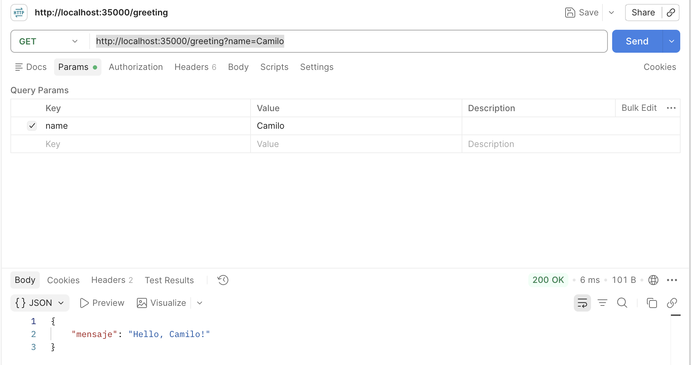

2. Greeting with spaces and UTF-8 characters:
    ```text
    http://localhost:35000/greeting?name=Ana%20Mar%C3%ADa%20Jos%C3%A9
    ```
   Should return:
    ```json
    {"mensaje":"Hello, Ana María José!"}
   ```
   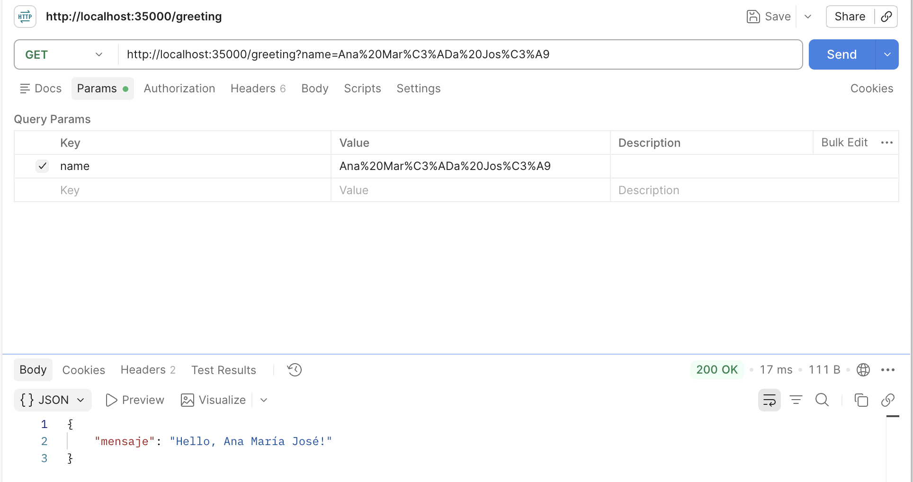
3. square of an integer number:
    ```text
    http://localhost:35000/square?value=5
    ```
   Should return:
    ```json
    {
      "value": 5.0,
      "square": 25.0
   }
   ```
   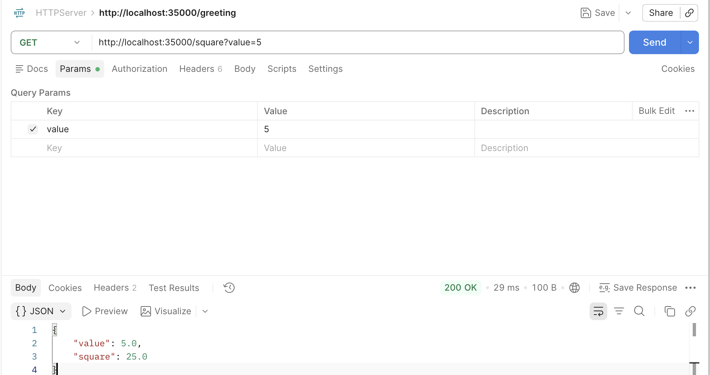
4. square of a negative decimal:
    ```text
    http://localhost:35000/square?value=-2.5
    ```
   Should return:
    ```json
    {
      "value": -2.5,
      "square": 6.25
   }
   ```
   
5. Square of cero:
    ```text
    http://localhost:35000/square?value=0
    ```
   Should return:
    ```json
    {
      "value": 0,
      "square": 0
   }
   ```
   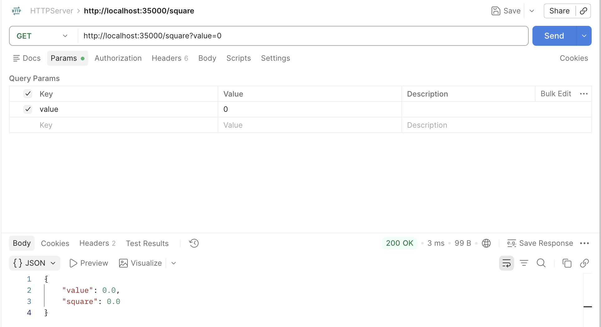
6. Server Time:
 ```text
 http://localhost:35000/server-time
 ```
Should return:
 ```json
{"serverTime": "...."}
  ```
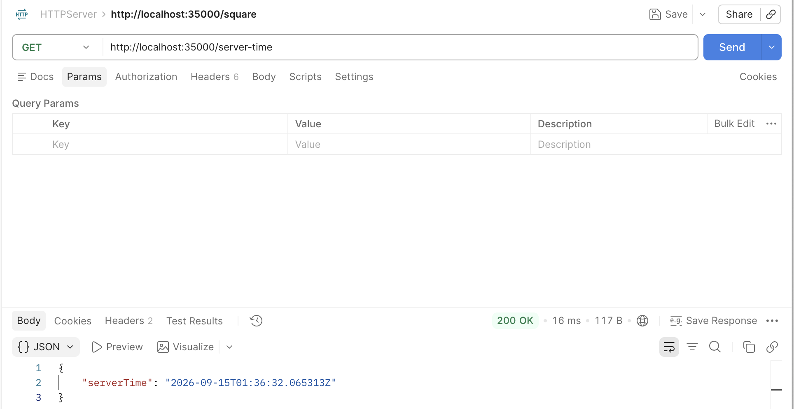
7. Server Health:
 ```text
 http://localhost:35000/health
 ```
Should return:
 ```json
{
   "status": "OK"
}
  ```
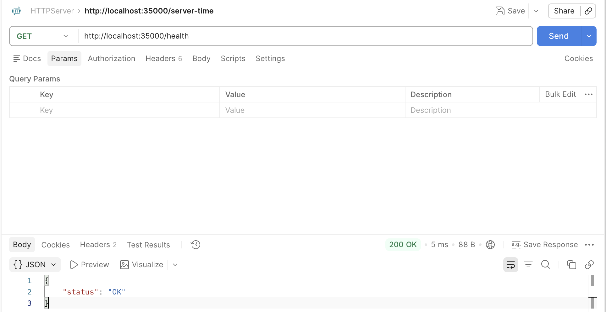
8. Static file:
 ```text
 http://localhost:35000/index.html
 ```

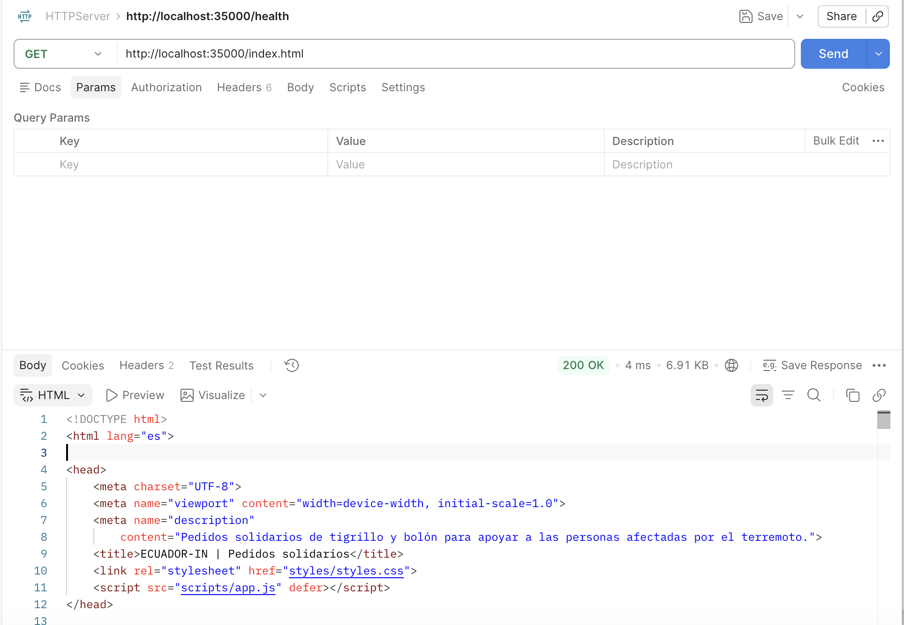

### Failed requests
1. Greeting without a name:
    ```text
    http://localhost:35000/greeting
    ```
   Should return:
    ```json
    {
      "mensaje": "Bad request: missing 'name' parameter"
   }
   ```
   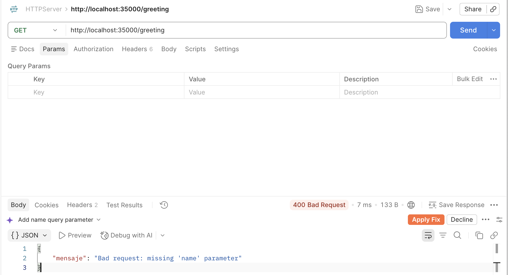
2. Greeting with empty name:
    ```text
    http://localhost:35000/greeting?name=
    ```
   Should return:
    ```json
    {
      "mensaje": "Bad request: missing 'name' parameter"
   }
   ```
   
3. Square with a none numerical value:
    ```text
    http://localhost:35000/square?value=abc
    ```
   Should return:
    ```json
    {
     "mensaje": "Bad request: missing or invalid 'value' parameter"
   }
   ```
   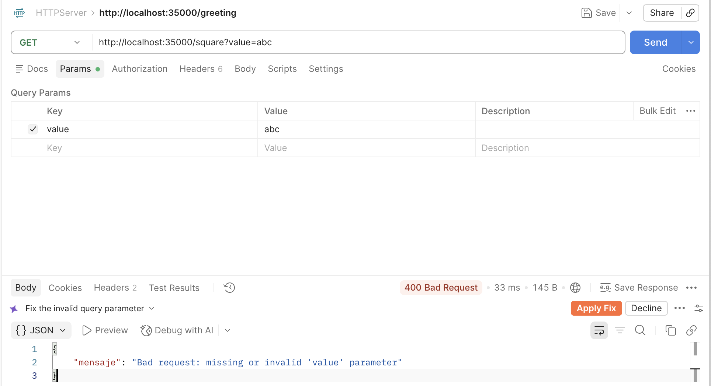
4. Invalid method
   ```text
    POST http://localhost:35000/square?value=abc
    ```
   Should return:
    ```json
    {
      "mensaje": "Bad request: method not allowed"
   }
   ```
   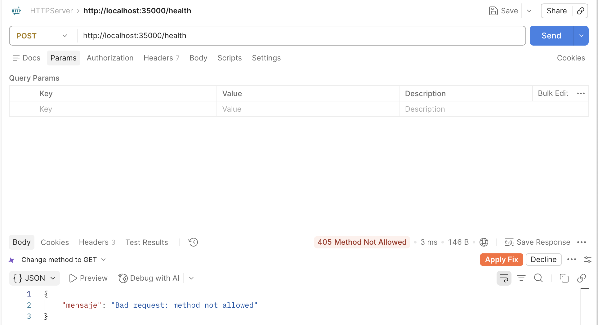
5. Non-existent service
   ```text
    http://localhost:35000/historial
    ```
   Should return:
    ```json
    {
      "mensaje": "Bad request: /historial"
   }
   ```
   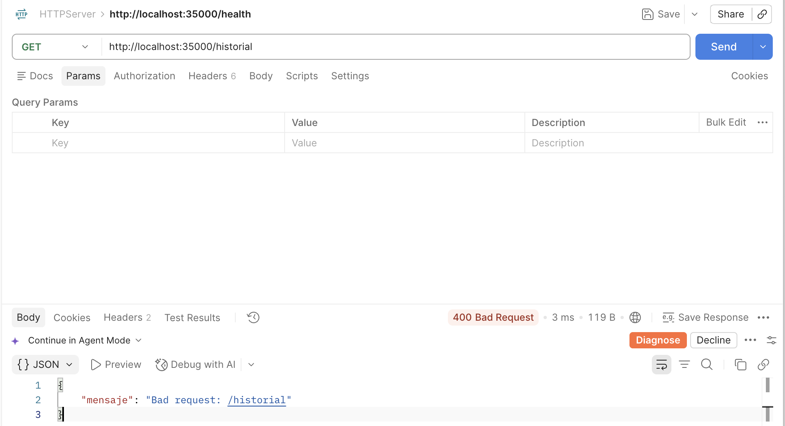